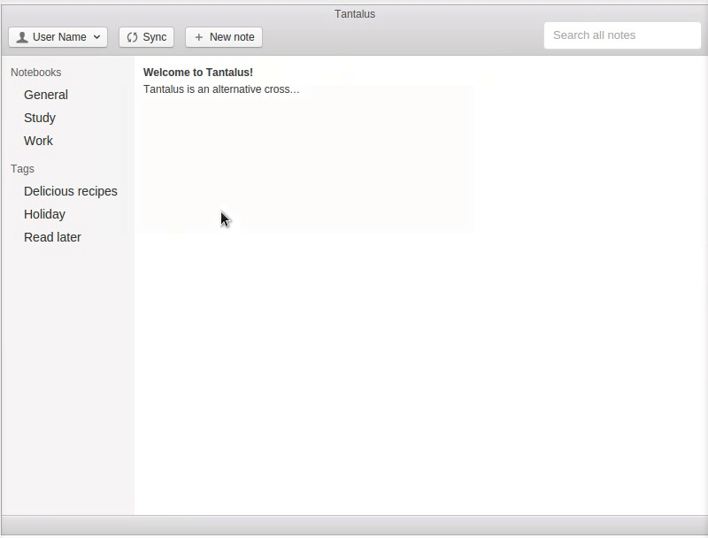

# Tantalus

[![Travis Build][travis-image]][travis-url]

Alternative cross-platform client for Evernote built in Electron.

**Disclaimer:** Work in progress! Please check progress in the roadmap below.

# Roadmap

The current stage in the roadmap is to design an UI that resembles Evernote's and implement the same functions with local storage. The synchronisation process with Evernote API will be implemented right after the app looks nice and functional, so we have it loosely coupled.

* **Notebooks**
  * [x] List
  * [ ] Create
  * [ ] Update
  * [ ] Delete
* **Tags**
  * [x] List
  * [ ] Create
  * [ ] Update
  * [ ] Delete
* **Notes**
  * [x] List
  * [x] Create
  * [x] Update
  * [x] Delete
* **Sync**
  * [x] Set dirty flags
  * [ ] Start sync process
  * [x] Display animation
  * Push to server:
    * [ ] Create
    * [ ] Update
    * [ ] Delete
  * Pull to local:
    * [ ] Create
    * [ ] Update
    * [ ] Delete
  * [ ] Merge differences

# License
MIT.

[travis-url]: https://travis-ci.org/fmoliveira/tantalus
[travis-image]: https://api.travis-ci.org/fmoliveira/tantalus.svg
